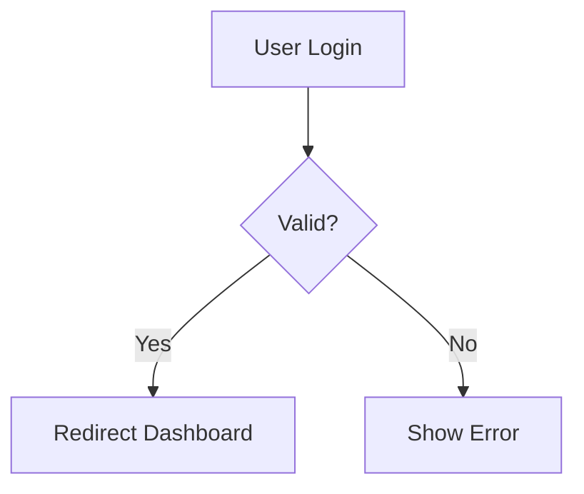
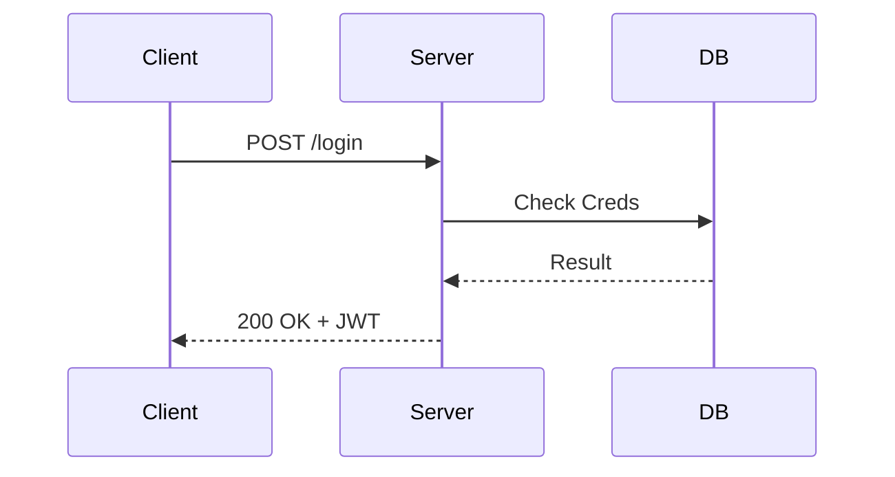

# Google Antigravity Documentation Guidelines (Deep Dive)

> **Purpose**: Templates and standards for maintaining prolonged project memory.  
> **Ref Rule**: [simple-documentation.md](simple-documentation.md)

## 📋 Table of Contents
1. [Project Archive (The Brain)](#1-project-archive-template)
2. [Effective Metadata](#2-effective-metadata)
3. [Artifact Standards](#3-artifact-standards)
4. [Mermaid Diagram Guide](#4-mermaid-diagram-guide)

---

## 1. Project Archive Template

**File**: `documents/00-project-doc-archive.md`

This specification is the **Index** of the project.

```markdown
# Project Document Archive

## 📊 Status
- **Last Updated**: YYYY-MM-DD
- **Total Documents**: XX

## 🗂 Document Index

### 01. Planning (기획)
| Index | Title | Path | Summary |
| :--- | :--- | :--- | :--- |
| 01-01 | Kick-off Meeting | [Link](./01-kickoff.md) | Initial scope and goals |
| 01-02 | Main PRD | [Link](./01-02-prd.md) | Core requirements |

### 02. Architecture (설계)
| Index | Title | Path | Summary |
| :--- | :--- | :--- | :--- |
| 02-01 | DB Schema | [Link](./02-schema.md) | PostgreSQL ERD |

## 🏷 Bookmarks & Tags
- #Auth: Login logic references
- #Payment: Stripe integration
```

---

## 2. Effective Metadata

Every markdown file **MUST** start with Frontmatter or a Header Block.

### Standard Header
```markdown
---
Title: User Authentication Guide
Type: Guide (Walkthrough)
Author: Antigravity
Date: 2025-12-13
Updates: 00-project-doc-archive.md
---
```

---

## 3. Artifact Standards

### Task List (`documents/artifacts/tasklist/`)
Used for tracking micro-tasks.
```markdown
- [x] [Frontend] Install dependencies
- [ ] [Backend] Setup TypeORM
- [ ] [DevOps] Dockerfile creation
```

### Knowledge (`documents/artifacts/knowledge/`)
Used for recording "Lessons Learned" or "Troubleshooting".
- **Format**: Problem -> Cause -> Solution -> Prevention.

---

## 4. Mermaid Diagram Guide

Use Mermaid for all technical visualizations.

### Flowchart (Logic)


### Sequence Diagram (API/Protocol)

